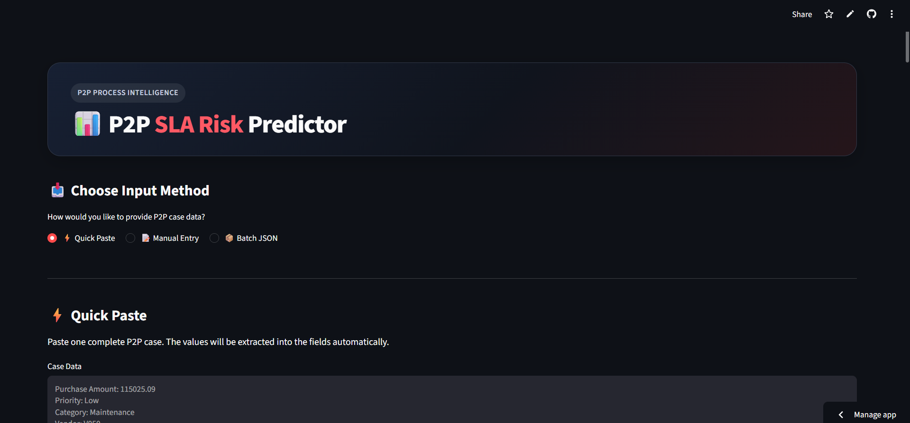

# 📊 P2P SLA Risk Predictor

An intelligent **Procure-to-Pay (P2P) Process Intelligence application** that predicts the probability of SLA breaches, classifies cases by risk level, and explains the key factors influencing each prediction.

The application combines **Machine Learning, SHAP Explainability, Process Intelligence, and Batch JSON Prediction** to help process owners identify high-risk P2P cases before an SLA breach occurs.

## 🚀 Project Overview

SLA breaches in Procure-to-Pay processes can result from process delays, excessive transition times, rework, approval issues, and other operational factors.

This project provides a predictive solution that:

- Predicts the probability of an SLA breach
- Classifies cases into **Low, Medium, and High Risk**
- Identifies the strongest factors influencing each prediction
- Uses **SHAP** for model explainability
- Supports prediction of multiple cases through a single JSON file
- Provides an interactive **Streamlit** dashboard
- Helps process owners prioritize cases requiring intervention
## 🖥️ Application Preview

### Quick Paste Interface

Users can quickly provide P2P case data using the structured Quick Paste input method.



### High-Risk Prediction

The model provides the SLA breach probability, decision threshold, predicted breach status, and risk classification.


### SHAP-Based Explainability

SHAP identifies the strongest factors influencing the individual prediction and shows whether they increase or decrease SLA breach risk.


### Low-Risk Prediction

The model also identifies cases with relatively low SLA breach probability.


### Batch Prediction & Risk Distribution

Multiple P2P cases can be processed simultaneously, with risk metrics and risk distribution presented through the dashboard.


## 🧠 Machine Learning Approach

The project uses **Logistic Regression** as the classification model.

### Prediction Pipeline

```text
P2P Case Data
      ↓
Data Preprocessing
      ↓
Feature Engineering
      ↓
Logistic Regression
      ↓
SLA Breach Probability
      ↓
Optimized Decision Threshold
      ↓
Risk Classification
      ↓
SHAP Explanation
```

The application uses an optimized decision threshold of **55%** for SLA breach classification.

## 📌 Input Features

| Feature | Description |
|---|---|
| Purchase Amount | Purchase/order value |
| Priority | Case priority |
| Category | Procurement category |
| Vendor ID | Vendor associated with the case |
| Elapsed Hours | Time elapsed until purchase order |
| Activities Completed | Number of completed process activities |
| Unique Activities | Number of unique activities completed |
| Budget Review | Whether budget review was completed |
| Approval Rework Count | Number of approval rework events |
| Total Rework Events | Total rework events observed |
| Average Transition Time | Average time between process activities |
| Maximum Transition Time | Maximum transition time observed |

## 🎯 Risk Classification

| Risk Level | Probability |
|---|---:|
| 🟢 LOW RISK | Below 55% |
| 🟡 MEDIUM RISK | 55% – 69.99% |
| 🔴 HIGH RISK | 70% or above |

The **55% threshold** is used as the optimized classification threshold.

## 🔎 SHAP Explainability

The application uses **SHAP (SHapley Additive exPlanations)** to explain individual predictions.

For each prediction, the application identifies the strongest contributing features and shows whether each factor:

- 🔴 Increases SLA breach risk
- 🟢 Decreases SLA breach risk

Each factor is also displayed with its SHAP impact and impact strength.

Example:

```text
Elapsed Hours To Purchase Order

Increases SLA breach risk • Strong impact

SHAP Impact: +5.657
```

This makes the prediction easier for business users to understand rather than treating the model as a black box.

## 📦 Batch JSON Prediction

The application supports prediction for multiple P2P cases at once.

Instead of entering cases individually, users can upload a single JSON file containing multiple cases.

### Example JSON

```json
[
  {
    "purchase_amount": 115025.09,
    "priority": "Low",
    "category": "Maintenance",
    "vendor_id": "V050",
    "elapsed_hours_to_purchase_order": 748.64,
    "activities_completed_to_purchase_order": 4,
    "unique_activities_completed": 3,
    "has_budget_review": 0,
    "approval_rework_count": 1,
    "total_rework_events_so_far": 1,
    "average_transition_time_so_far": 243.23,
    "maximum_transition_time_so_far": 657.69
  }
]
```

The batch dashboard provides:

- Number of cases processed
- High-risk cases
- Medium-risk cases
- Low-risk cases
- Predicted SLA breaches
- Average predicted breach probability
- Risk distribution
- Filtering by risk level
- Filtering by category
- Filtering by vendor
- CSV export of results

## 🖥️ Streamlit Application

The application provides three input methods.

### Quick Paste

Users can paste a complete P2P case in a structured format and automatically populate the corresponding fields.

### Manual Entry

Users can enter individual P2P case characteristics directly through the interface.

### Batch JSON

Users can upload a JSON file containing multiple P2P cases and receive predictions for all cases simultaneously.

## 🛠️ Technology Stack

- **Python**
- **Pandas**
- **NumPy**
- **Scikit-learn**
- **Logistic Regression**
- **SHAP**
- **Joblib**
- **Streamlit**
- **Matplotlib**
- **Process Intelligence**

## 📁 Project Structure

```text
p2p-sla-risk-predictor/
│
├── app.py
│
├── models/
│   ├── p2p_logistic_regression.joblib
│   ├── p2p_preprocessor.joblib
│   └── p2p_threshold.joblib
│
├── notebooks/
├── reports/
├── scripts/
│
├── src/
│   ├── features/
│   └── prediction.py
│
├── .gitignore
├── README.md
└── requirements.txt
```

## ⚙️ Installation

Clone the repository:

```bash
git clone https://github.com/Abubakkar235/p2p-sla-risk-predictor.git
```

Navigate to the project directory:

```bash
cd p2p-sla-risk-predictor
```

Create a virtual environment:

```bash
python -m venv .venv
```

Activate the virtual environment on Windows:

```powershell
.venv\Scripts\activate
```

Install dependencies:

```bash
pip install -r requirements.txt
```

## ▶️ Run the Application

Start the Streamlit application:

```bash
streamlit run app.py
```

The application will open in your browser.

## 🌐 Live Demo

🚀 **[Launch the Streamlit App](https://p2p-sla-risk-predictor-9pwcqz8bfh9enklmbzgeub.streamlit.app/)**

💻 **[View the GitHub Repository](https://github.com/Abubakkar235/p2p-sla-risk-predictor)**

## 📈 Business Value

The solution can help P2P process owners:

- Identify high-risk cases early
- Prioritize operational intervention
- Understand the drivers behind SLA risk
- Monitor process delays and rework
- Analyze risk across vendors and categories
- Reduce manual case-by-case analysis
- Support proactive SLA management

## 🔬 Project Focus

This project demonstrates the integration of:

```text
Process Intelligence
        +
Feature Engineering
        +
Machine Learning
        +
Model Explainability
        +
Interactive Analytics
        +
Batch Prediction
```

The goal is not only to predict **whether an SLA breach may occur**, but also to provide business users with an understanding of **why the model made that prediction**.

## 👤 Author

**Abubakkar235**

[GitHub Profile](https://github.com/Abubakkar235)

## 📄 License

This project currently does not specify an open-source license.