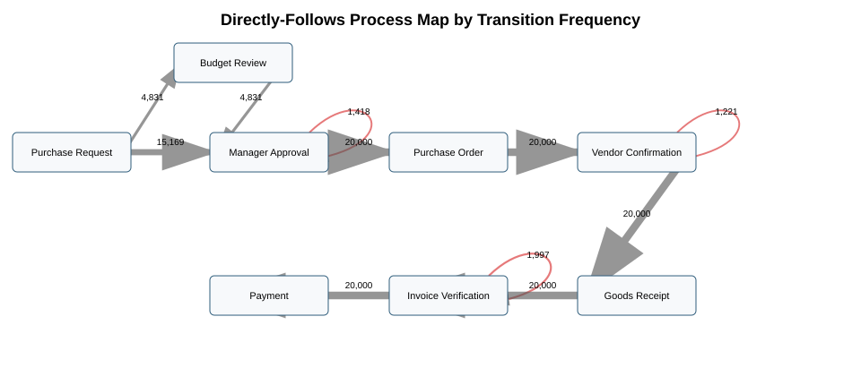
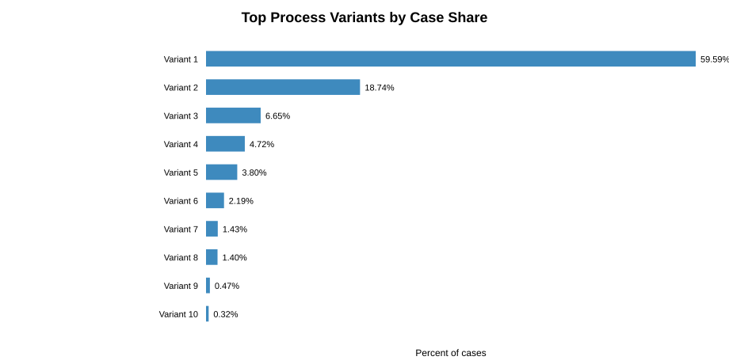
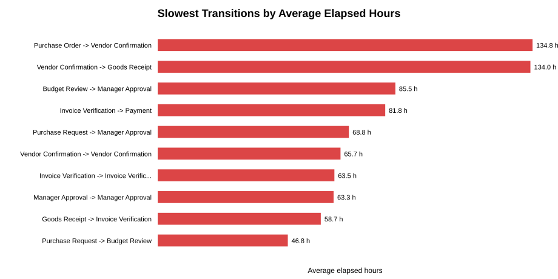
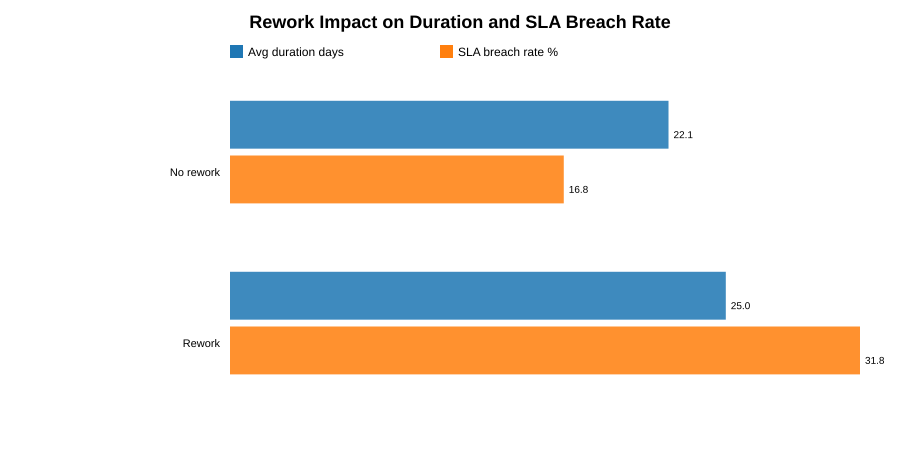
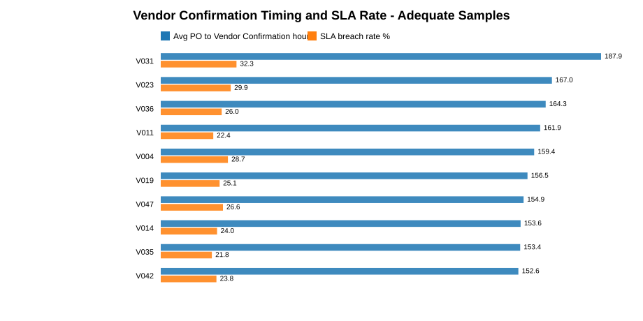
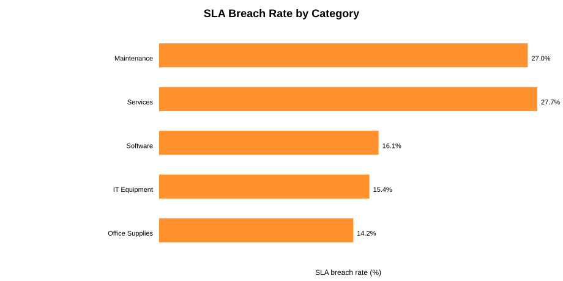

# Process Mining Report - Phase 3

## Scope

This report uses the raw synthetic P2P datasets in `data/raw/` and does not modify them. No machine-learning model was trained. PM4Py is not installed in the current runtime, so the process map and process-mining metrics were computed with a reproducible pandas-based directly-follows analysis.

## Key Findings

- The dominant happy-path variant covers 59.59% of cases and has an SLA breach rate of 13.42%.
- The second-largest variant includes Budget Review, covers 18.74% of cases, and has a higher SLA breach rate of 27.69%.
- The slowest average transition is `Purchase Order -> Vendor Confirmation` at 134.8 hours on average.
- Rework affects 4,334 cases (21.67%) and is associated with higher average duration (25.00 vs 22.11 days) and higher SLA breach rate (31.77% vs 16.83%).
- Vendor Confirmation timing differs materially by vendor. Among vendors with at least 200 cases, V031 has the highest average Purchase Order to Vendor Confirmation elapsed time.

## Process Map and Transition Frequency

| activity | next_activity | frequency |
| --- | --- | --- |
| Goods Receipt | Invoice Verification | 20000 |
| Manager Approval | Purchase Order | 20000 |
| Invoice Verification | Payment | 20000 |
| Purchase Order | Vendor Confirmation | 20000 |
| Vendor Confirmation | Goods Receipt | 20000 |
| Purchase Request | Manager Approval | 15169 |
| Budget Review | Manager Approval | 4831 |
| Purchase Request | Budget Review | 4831 |
| Invoice Verification | Invoice Verification | 1997 |
| Manager Approval | Manager Approval | 1418 |
| Vendor Confirmation | Vendor Confirmation | 1221 |

## Process Variants

Observed variants: **16**.

Top 10 variants by case count:

| variant_rank | cases | case_pct | sla_breaches | sla_breach_rate | avg_duration_days | median_duration_days | activity_sequence |
| --- | --- | --- | --- | --- | --- | --- | --- |
| 1 | 11918 | 59.59 | 1599 | 0.13 | 21.39 | 20.90 | Purchase Request -> Manager Approval -> Purchase Order -> Vendor Confirmation -> Goods Receipt -> Invoice Verification -> Payment |
| 2 | 3748 | 18.74 | 1038 | 0.28 | 24.41 | 23.23 | Purchase Request -> Budget Review -> Manager Approval -> Purchase Order -> Vendor Confirmation -> Goods Receipt -> Invoice Verification -> Payment |
| 3 | 1330 | 6.65 | 323 | 0.24 | 23.67 | 22.52 | Purchase Request -> Manager Approval -> Purchase Order -> Vendor Confirmation -> Goods Receipt -> Invoice Verification -> Invoice Verification -> Payment |
| 4 | 944 | 4.72 | 248 | 0.26 | 24.27 | 23.32 | Purchase Request -> Manager Approval -> Manager Approval -> Purchase Order -> Vendor Confirmation -> Goods Receipt -> Invoice Verification -> Payment |
| 5 | 761 | 3.81 | 199 | 0.26 | 24.41 | 23.85 | Purchase Request -> Manager Approval -> Purchase Order -> Vendor Confirmation -> Vendor Confirmation -> Goods Receipt -> Invoice Verification -> Payment |
| 6 | 438 | 2.19 | 216 | 0.49 | 27.81 | 27.12 | Purchase Request -> Budget Review -> Manager Approval -> Purchase Order -> Vendor Confirmation -> Goods Receipt -> Invoice Verification -> Invoice Verification -> Payment |
| 7 | 286 | 1.43 | 114 | 0.40 | 26.35 | 25.89 | Purchase Request -> Budget Review -> Manager Approval -> Purchase Order -> Vendor Confirmation -> Vendor Confirmation -> Goods Receipt -> Invoice Verification -> Payment |
| 8 | 281 | 1.41 | 125 | 0.44 | 26.93 | 25.81 | Purchase Request -> Budget Review -> Manager Approval -> Manager Approval -> Purchase Order -> Vendor Confirmation -> Goods Receipt -> Invoice Verification -> Payment |
| 9 | 94 | 0.47 | 47 | 0.50 | 27.87 | 28.03 | Purchase Request -> Manager Approval -> Manager Approval -> Purchase Order -> Vendor Confirmation -> Goods Receipt -> Invoice Verification -> Invoice Verification -> Payment |
| 10 | 65 | 0.33 | 33 | 0.51 | 27.26 | 27.94 | Purchase Request -> Manager Approval -> Purchase Order -> Vendor Confirmation -> Vendor Confirmation -> Goods Receipt -> Invoice Verification -> Invoice Verification -> Payment |

Variants with Budget Review and repeated activities generally show higher SLA breach rates than the happy path. This is correlation, not proof that the additional steps independently cause breaches.

## Bottlenecks and Transition Timing

Timing is measured as elapsed time from one event timestamp to the next event timestamp within the same case. These values approximate waiting time between activities, not exact hands-on processing time.

| from_to | occurrences | avg_elapsed_hours | median_elapsed_hours | p95_elapsed_hours |
| --- | --- | --- | --- | --- |
| Purchase Order -> Vendor Confirmation | 20000 | 134.80 | 121.34 | 313.56 |
| Vendor Confirmation -> Goods Receipt | 20000 | 134.04 | 140.28 | 266.37 |
| Budget Review -> Manager Approval | 4831 | 85.47 | 71.57 | 187.93 |
| Invoice Verification -> Payment | 20000 | 81.83 | 76.35 | 147.18 |
| Purchase Request -> Manager Approval | 15169 | 68.75 | 50.31 | 166.07 |
| Vendor Confirmation -> Vendor Confirmation | 1221 | 65.75 | 52.91 | 120.24 |
| Invoice Verification -> Invoice Verification | 1997 | 63.55 | 52.61 | 117.59 |
| Manager Approval -> Manager Approval | 1418 | 63.26 | 52.19 | 117.84 |
| Goods Receipt -> Invoice Verification | 20000 | 58.65 | 48.55 | 120.53 |
| Purchase Request -> Budget Review | 4831 | 46.80 | 43.10 | 100.44 |
| Manager Approval -> Purchase Order | 20000 | 26.55 | 22.20 | 72.98 |

The two largest average delays are `Purchase Order -> Vendor Confirmation` and `Vendor Confirmation -> Goods Receipt`, making supplier response and goods receipt timing the strongest process bottleneck candidates.

## Activity-Level Performance

| activity | frequency | avg_hours_since_prev | median_hours_since_prev | p95_hours_since_prev |
| --- | --- | --- | --- | --- |
| Goods Receipt | 20000 | 134.04 | 140.28 | 266.37 |
| Vendor Confirmation | 21221 | 130.83 | 119.16 | 310.11 |
| Payment | 20000 | 81.83 | 76.35 | 147.18 |
| Manager Approval | 21418 | 72.16 | 52.17 | 167.01 |
| Invoice Verification | 21997 | 59.10 | 48.88 | 119.99 |
| Budget Review | 4831 | 46.80 | 43.10 | 100.44 |
| Purchase Order | 20000 | 26.55 | 22.20 | 72.98 |
| Purchase Request | 20000 |  |  |  |

`Goods Receipt` and `Vendor Confirmation` have the highest average elapsed time since the previous activity. `Purchase Request` has no previous-activity timing because it is the first logged activity.

## Rework Findings

| has_rework | cases | avg_duration_days | median_duration_days | sla_breaches | sla_breach_rate | case_pct |
| --- | --- | --- | --- | --- | --- | --- |
| False | 15666 | 22.11 | 21.13 | 2637 | 0.17 | 78.33 |
| True | 4334 | 25.00 | 23.98 | 1377 | 0.32 | 21.67 |

Repeated activities by activity:

| activity | cases_with_repeat | extra_repetitions |
| --- | --- | --- |
| Invoice Verification | 1997 | 1997 |
| Manager Approval | 1418 | 1418 |
| Vendor Confirmation | 1221 | 1221 |

Rework is concentrated in Invoice Verification, Manager Approval, and Vendor Confirmation. Rework cases have longer durations and higher SLA breach rates, so rework indicators should be considered for later prediction and monitoring.

## Vendor Findings

Vendor comparisons use an adequate-sample threshold of at least 200 total cases. In this dataset all 50 vendors meet that threshold, but the threshold is retained so future analyses avoid overinterpreting small samples.

Top vendors by slowest Purchase Order to Vendor Confirmation response:

| vendor_id | total_cases | avg_vendor_confirmation_hours | median_vendor_confirmation_hours | p95_vendor_confirmation_hours | sla_breach_rate | vendor_confirmation_zscore |
| --- | --- | --- | --- | --- | --- | --- |
| V031 | 399 | 187.95 | 166.50 | 428.94 | 0.32 | 2.85 |
| V023 | 415 | 166.97 | 146.86 | 373.10 | 0.30 | 1.73 |
| V036 | 396 | 164.30 | 143.76 | 389.39 | 0.26 | 1.59 |
| V011 | 388 | 161.95 | 145.62 | 359.57 | 0.22 | 1.46 |
| V004 | 443 | 159.39 | 142.81 | 377.93 | 0.29 | 1.32 |
| V019 | 406 | 156.55 | 143.98 | 338.66 | 0.25 | 1.17 |
| V047 | 418 | 154.88 | 142.73 | 405.23 | 0.27 | 1.08 |
| V014 | 391 | 153.61 | 144.33 | 314.16 | 0.24 | 1.01 |
| V035 | 385 | 153.42 | 142.06 | 360.16 | 0.22 | 1.00 |
| V042 | 425 | 152.65 | 140.42 | 379.95 | 0.24 | 0.96 |

Top vendors by SLA breach rate:

| vendor_id | total_cases | sla_breaches | sla_breach_rate | avg_duration_days | avg_vendor_confirmation_hours |
| --- | --- | --- | --- | --- | --- |
| V031 | 399 | 129 | 0.32 | 25.16 | 187.95 |
| V023 | 415 | 124 | 0.30 | 24.55 | 166.97 |
| V004 | 443 | 127 | 0.29 | 24.19 | 159.39 |
| V047 | 418 | 111 | 0.27 | 23.57 | 154.88 |
| V003 | 386 | 101 | 0.26 | 23.77 | 144.96 |
| V036 | 396 | 103 | 0.26 | 23.82 | 164.30 |
| V019 | 406 | 102 | 0.25 | 23.81 | 156.55 |
| V027 | 408 | 102 | 0.25 | 23.11 | 142.46 |
| V001 | 355 | 86 | 0.24 | 23.48 | 149.08 |
| V014 | 391 | 94 | 0.24 | 23.75 | 153.61 |

Average Vendor Confirmation response time and vendor SLA breach rate have a high vendor-level correlation in this dataset (0.92). This is useful as a diagnostic signal, but it should not be interpreted as causal without controlled analysis.

## SLA Findings by Priority and Category

### Priority

| priority | cases | avg_duration_days | median_duration_days | p95_duration_days | sla_breaches | sla_breach_rate |
| --- | --- | --- | --- | --- | --- | --- |
| Low | 4954 | 27.51 | 27.01 | 41.01 | 1084 | 0.22 |
| Medium | 10987 | 22.51 | 21.88 | 33.88 | 2297 | 0.21 |
| High | 4059 | 17.56 | 16.92 | 26.37 | 633 | 0.16 |

### Category

| category | cases | avg_duration_days | median_duration_days | p95_duration_days | sla_breaches | sla_breach_rate |
| --- | --- | --- | --- | --- | --- | --- |
| Maintenance | 3959 | 24.25 | 23.09 | 38.04 | 1070 | 0.27 |
| Services | 3989 | 24.24 | 23.13 | 37.04 | 1106 | 0.28 |
| Software | 4052 | 21.81 | 21.05 | 34.11 | 652 | 0.16 |
| IT Equipment | 3996 | 21.75 | 21.06 | 33.25 | 616 | 0.15 |
| Office Supplies | 4004 | 21.69 | 21.05 | 33.20 | 570 | 0.14 |

Low-priority cases have the longest average duration and the highest priority-level breach rate. Services and Maintenance have the highest category-level breach rates.

## Business Interpretation

The process appears mostly standardized around a seven-step happy path, but meaningful operational variation is introduced by Budget Review and by rework loops. The strongest timing pressure appears around vendor-facing and downstream receiving steps. Cases that require repeated approvals, vendor confirmations, or invoice checks are associated with longer cycle times and higher SLA breach rates.

## Data Limitations

- The event log has one timestamp per activity, so transition timing represents elapsed waiting time between events, not exact activity processing time.
- The data is synthetic, so operational interpretations should be framed as portfolio-project insights rather than real enterprise conclusions.
- All event statuses are `Completed`, so status has no analytical variation in the current event log.
- Vendor findings are observational. High vendor response time and SLA breach rate are correlated here, but causality is not established.
- Case-level duration and SLA outcome fields should be treated carefully later because they can leak target information into predictive models.

## Recommendations for Feature Engineering

- Variant rank or encoded activity sequence family available up to the prediction point.
- Directly-follows transition counts and elapsed-time features observed so far.
- Presence of Budget Review.
- Rework flags and repeat counts by activity, especially Invoice Verification, Manager Approval, and Vendor Confirmation.
- Vendor Confirmation elapsed time or vendor historical response features, computed using only prior cases or training-fold history.
- Vendor historical SLA breach rate with sample-size smoothing to avoid unstable estimates.
- Priority, category, department mix, purchase amount, and vendor id encodings.
- Early-cycle elapsed time features, such as time from Purchase Request to Manager Approval or Purchase Order.
- Bottleneck exposure indicators for slow transitions, especially Purchase Order to Vendor Confirmation and Vendor Confirmation to Goods Receipt.
